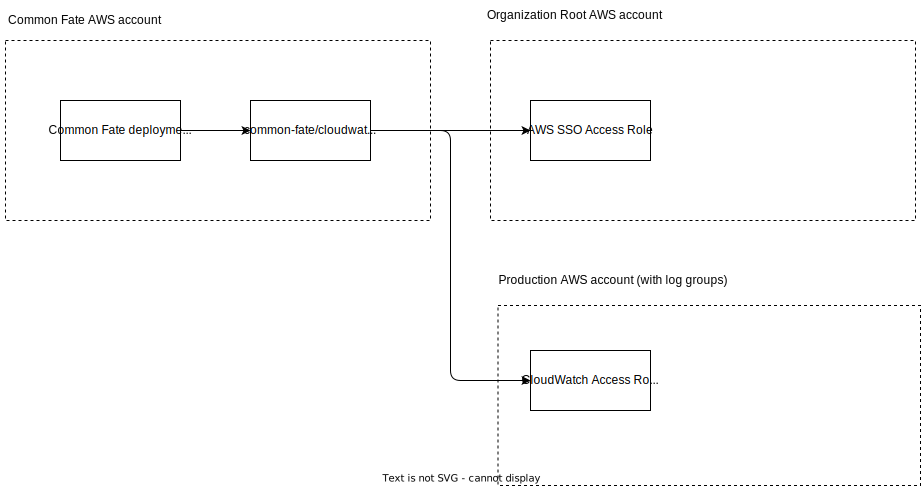

<p align="center"></p>

<h1 align="center">Common Fate CloudWatch Log Groups Provider</h1>

<p align="center">An <a href="https://docs.commonfate.io/common-fate/next/providers/providers">Access Provider</a> for automating permissions to CloudWatch Log Groups.</p>

<p align="center">
<a align="center"  href="https://join.slack.com/t/commonfatecommunity/shared_invite/zt-q4m96ypu-_gYlRWD3k5rIsaSsqP7QMg"></a>
</p>
<br/>

## Access

This Access Provider provisions a temporary AWS IAM Identity Center Permission Set which grants access to read a CloudWatch log group. When making an access request, users will specify the following parameters:

| Parameter   | Description                                                 |
| ----------- | ----------------------------------------------------------- |
| `log_group` | the ARN of the CloudWatch log group to grant read access to |

The Access Provider provisions a Permission Set and attaches the following inline policy:

```jsonc
{
    "Version": "2012-10-17",
        "Statement": [
            {
                "Effect": "Allow",
                "Action": [
                    "logs:GetLogDelivery",
                    "logs:GetLogEvents",
                    "logs:GetLogGroupFields",
                    "logs:GetLogRecord",
                    "logs:GetQueryResults",
                    "logs:StartQuery",
                    "logs:StopQuery",
                    "logs:TestMetricFilter",
                    "logs:FilterLogEvents",
                    "logs:DescribeSubscriptionFilters",
                    "logs:ListTagsLogGroup",
                    "logs:GetDataProtectionPolicy",
                ],
                "Resource": [f"{target.log_group}:*"],
            },
            // These permissions are not required to view log group data,
            // but allowing users to view metadata about logs results in
            // a far better console user experience.
            //
            // This allows for users to view metadata about log groups
            // other than the one they have requested, and to view
            // metric data. This provider does not consider these to be
            // sensitive and in fact may be of assistance to a user who
            // is using this provider to get access to logs when responding
            // to an incident.
            //
            // In future we will introduce a configuration option allowing
            // this policy statement to be disabled, so that metadata
            // about other log groups and metrics cannot be viewed.
            {
                "Effect": "Allow",
                "Action": [
                    "logs:DescribeLogGroups",
                    "logs:DescribeLogStreams",
                    "logs:DescribeMetricFilters",
                    "cloudwatch:GetMetricData",
                ],
                "Resource": ["*"],
            },
        ],
}
```

## Deployment architecture

We recommend the adopting the following account architecture when deploying this Access Provider:



The Access Provider should be deployed in the same AWS account as your Common Fate deployment.

## Getting started

### Prerequisites

To use this Access Provider you'll need to have [deployed Common Fate](https://docs.commonfate.io/common-fate/next/deploying-common-fate/deploying-common-fate). You'll also need to [download the `cf` CLI](https://docs.commonfate.io/common-fate/next/providers/setup).

You will also need AWS credentials with the ability to deploy CloudFormation templates.

To use this Access Provider, you need to have AWS IAM Identity Center set up in your AWS Organization. Please [contact us via Slack](https://join.slack.com/t/commonfatecommunity/shared_invite/zt-q4m96ypu-_gYlRWD3k5rIsaSsqP7QMg) if you'd like to use this Access Provider, but are not using IAM Identity Center.

### 1. Deploy access roles

First, deploy the IAM roles below.

#### CloudWatch read role

This role is used to list CloudWatch log groups to determine the available log groups for users to select.

Deploy this role into the account with the log groups you wish to grant access to:

[](https://console.aws.amazon.com/cloudformation/home#/stacks/new?stackName=cf-access-common-fate-cloudwatch-log-groups-cloudwatch-read&templateURL=https://common-fate-registry-public.s3.us-west-2.amazonaws.com/common-fate/cloudwatch-log-groups/latest/roles/cloudwatch-read.json)

#### AWS SSO provisioning role

This role allows the Access Provider to create temporary [Permission Sets](https://docs.aws.amazon.com/singlesignon/latest/userguide/permissionsetsconcept.html) in IAM Identity Center, and attach an inline policy allowing read access to CloudWatch log data.

Deploy this role into either the root account of your AWS organization, or into an account which is given [Delegated Administration](https://docs.aws.amazon.com/singlesignon/latest/userguide/delegated-admin.html) privileges:

[](https://console.aws.amazon.com/cloudformation/home#/stacks/new?stackName=cf-access-common-fate-cloudwatch-log-groups-sso&templateURL=https://common-fate-registry-public.s3.us-west-2.amazonaws.com/common-fate/cloudwatch-log-groups/latest/roles/sso.json)

### 2. Deploy the Access Provider

To deploy this Access Provider, open a terminal window and assume an AWS role with access to deploy CloudFormation resources in the Common Fate account. Then, run:

```
cf provider deploy
```

and select the `common-fate/cloudwatch-log-groups` Provider when prompted.
